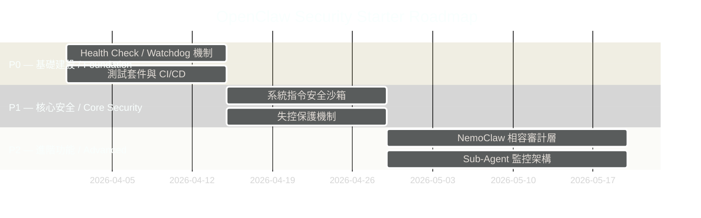
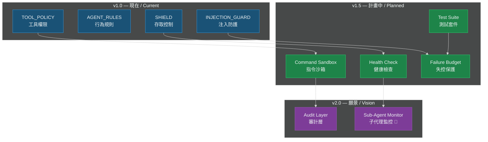

# 🗺️ OpenClaw Security Starter — Roadmap

# OpenClaw 安全啟動器 — 發展路線圖

> 本文件概述 OpenClaw Security Starter 的改進計畫，涵蓋健康監控、安全沙箱、審計強化等六大方向。
> This document outlines the improvement roadmap for OpenClaw Security Starter, covering six major initiatives including health monitoring, security sandbox, and audit enhancement.

---

## 路線圖總覽 / Roadmap Overview

## 架構演進 / Architecture Evolution

## 優先級矩陣 / Priority Matrix

| 優先級 | 提案 / Proposal | 理由 / Rationale |
|--------|----------------|-----------------|
| **P0** | [Health Check / Watchdog 機制](proposals/health-check-watchdog.md) | 最基本的運維需求 / Essential for production ops |
| **P0** | [測試套件與 CI/CD](proposals/test-suite-ci-cd.md) | 後續開發的基礎 / Foundation for future development |
| **P1** | [系統指令安全沙箱](proposals/system-command-sandbox.md) | 直接提升安全性 / Direct security improvement |
| **P1** | [失控保護機制](proposals/failure-budget-rate-cap.md) | 核心安全機制 / Core safety mechanism |
| **P2** | [NemoClaw 相容審計層](proposals/nemoclaw-audit-layer.md) | 對接生態系 / Ecosystem integration |
| **P2** | [Sub-Agent 監控架構](proposals/sub-agent-monitoring.md) | v2.0 目標 / v2.0 target |

## 背景 / Background

此路線圖源自社群討論，主要參與者包括：
- 舊金山後端工程師提出的 K8s 自癒架構概念
- 對 NVIDIA NemoClaw 審計層效能影響的討論
- 工程師回饋指出 agent 可以內建執行系統指令（`df`, `ps`, `du` 等）進行自我監控

This roadmap originates from community discussions, key inputs include:
- K8s-inspired self-healing architecture from a San Francisco backend engineer
- Discussions about NVIDIA NemoClaw's audit layer performance impact
- Engineer feedback on agents running system commands (`df`, `ps`, `du`, etc.) for self-monitoring

## 設計原則 / Design Principles

1. **安全第一 / Security First** — 所有新功能都必須通過現有的 4 層安全驗證
2. **效能意識 / Performance Aware** — 特別是審計層，不應顯著影響回應時間
3. **可配置 / Configurable** — 所有功能都可透過 `security.config.json` 開關
4. **向後相容 / Backward Compatible** — 不破壞現有的安全策略
5. **可觀測 / Observable** — 所有行為都有日誌追蹤

## 貢獻指南 / Contributing

每個提案都有獨立的文件，包含詳細的問題描述、架構設計和驗收標準。歡迎針對任何提案提交 PR！

Each proposal has a dedicated document with detailed problem description, architecture design, and acceptance criteria. PRs are welcome for any proposal!

### 如何開始 / Getting Started

1. 選擇一個感興趣的提案 / Pick a proposal that interests you
2. 閱讀對應的提案文件 / Read the proposal document
3. 在對應的 GitHub Issue 上留言 / Comment on the related GitHub Issue
4. Fork → Branch → PR

## 相關 Issues / Related Issues

- [#3 — feat: Health Check / Watchdog 機制](https://github.com/grabee-chen/openclaw-security-starter/issues/3)
- [#4 — feat: Sub-Agent 監控架構 — 龍蝦自癒模式](https://github.com/grabee-chen/openclaw-security-starter/issues/4)
- [#5 — feat: 系統指令安全沙箱](https://github.com/grabee-chen/openclaw-security-starter/issues/5)
- [#6 — feat: 失控保護機制](https://github.com/grabee-chen/openclaw-security-starter/issues/6)
- [#7 — feat: NemoClaw 相容審計層](https://github.com/grabee-chen/openclaw-security-starter/issues/7)
- [#8 — chore: 加入測試套件與 CI/CD](https://github.com/grabee-chen/openclaw-security-starter/issues/8)

---

> 🦞 *「龍蝦會斷肢再生，系統也能自我修復」*
> *"Lobsters regenerate lost limbs; systems can self-heal too"*
