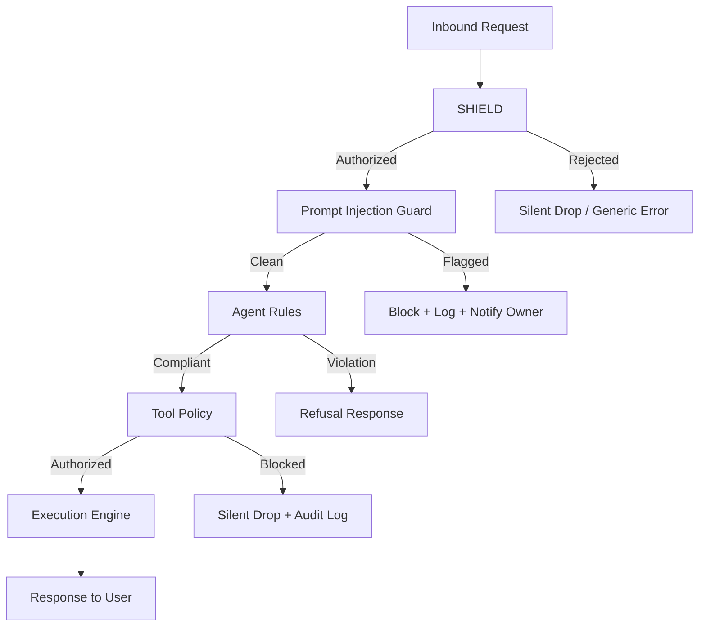

# Security Architecture — OpenClaw Security Starter

**Version:** 1.0.0 (Basic Edition)
**Deployment Target:** Docker Container (Local / Cloud)

---

## 1. System Overview

The OpenClaw Security Starter implements a **Multi-Layer Security Stack** deployed as a Docker container. The architecture follows a defense-in-depth model, where each layer independently validates trust before passing execution to the next layer.

```
┌─────────────────────────────────────────────────────────────────┐
│                     INBOUND REQUEST                             │
│                  (User Mention / Command)                        │
└────────────────────────────┬────────────────────────────────────┘
                             │
                             ▼
┌─────────────────────────────────────────────────────────────────┐
│  LAYER 1: SHIELD                                                │
│  ─────────────────────────────────────────────                  │
│  • Owner-Only Mode enforcement                                  │
│  • @mention requirement validation                              │
│  • Principal trust level lookup                                 │
│  • Channel authorization check                                  │
└────────────────────────────┬────────────────────────────────────┘
                             │ Authorized
                             ▼
┌─────────────────────────────────────────────────────────────────┐
│  LAYER 2: PROMPT INJECTION GUARD                                │
│  ─────────────────────────────────────────────                  │
│  • Keyword blocklist scan                                       │
│  • Structural anomaly detection                                 │
│  • Encoding / obfuscation detection                             │
│  • Input length enforcement                                     │
└────────────────────────────┬────────────────────────────────────┘
                             │ Clean
                             ▼
┌─────────────────────────────────────────────────────────────────┐
│  LAYER 3: AGENT RULES                                           │
│  ─────────────────────────────────────────────                  │
│  • Behavioral constitution enforcement                          │
│  • Absolute rule gate (AR-01 through AR-05)                     │
│  • Response formatting standards                                │
│  • Conflict resolution (rules win)                              │
└────────────────────────────┬────────────────────────────────────┘
                             │ Compliant
                             ▼
┌─────────────────────────────────────────────────────────────────┐
│  LAYER 4: TOOL POLICY                                           │
│  ─────────────────────────────────────────────                  │
│  • Least-privilege tool permission check                        │
│  • T0 (BLOCKED) tools physically removed                        │
│  • Tool argument injection re-scan                              │
│  • Execution audit logging                                      │
└────────────────────────────┬────────────────────────────────────┘
                             │ Authorized + Audited
                             ▼
┌─────────────────────────────────────────────────────────────────┐
│  EXECUTION ENGINE                                               │
│  (OpenClaw Agent Runtime — Port 18789)                          │
└─────────────────────────────────────────────────────────────────┘
```

---

## 2. Deployment Architecture (Docker-First)

```
┌─────────────────────────────────────────────────┐
│  Container Hosting Platform (Local/Cloud)       │
│                                                 │
│  ┌───────────────────────────────────────────┐  │
│  │  Docker Container                         │  │
│  │                                           │  │
│  │  Base: ghcr.io/openclaw/openclaw:latest   │  │
│  │                                           │  │
│  │  Persistent Volume: /home/node/.openclaw/ │  │
│  │  ├── config/security.config.json          │  │
│  │  ├── security/SHIELD.md                   │  │
│  │  ├── security/AGENT_RULES.md              │  │
│  │  ├── security/PROMPT_INJECTION_GUARD.md   │  │
│  │  └── security/TOOL_POLICY.md              │  │
│  │                                           │  │
│  │  Exposed Port: 18789                      │  │
│  └───────────────────────────────────────────┘  │
│                                                 │
│  Build Method: Dockerfile (zbpack.json)         │
└─────────────────────────────────────────────────┘
```

---

## 3. Security Layer Dependencies



---

## 4. Configuration File Hierarchy

| Priority | Source | Notes |
|----------|--------|-------|
| 1 (Highest) | `/home/node/.openclaw/config/security.config.json` | Persisted via volume mount |
| 2 | Environment Variables (`OPENCLAW_*`) | Set via `docker run -e` or Dashboard |
| 3 (Lowest) | Built-in defaults (image defaults) | Failsafe; always most restrictive |


*This document is part of the OpenClaw Security Starter — Basic Edition.*
