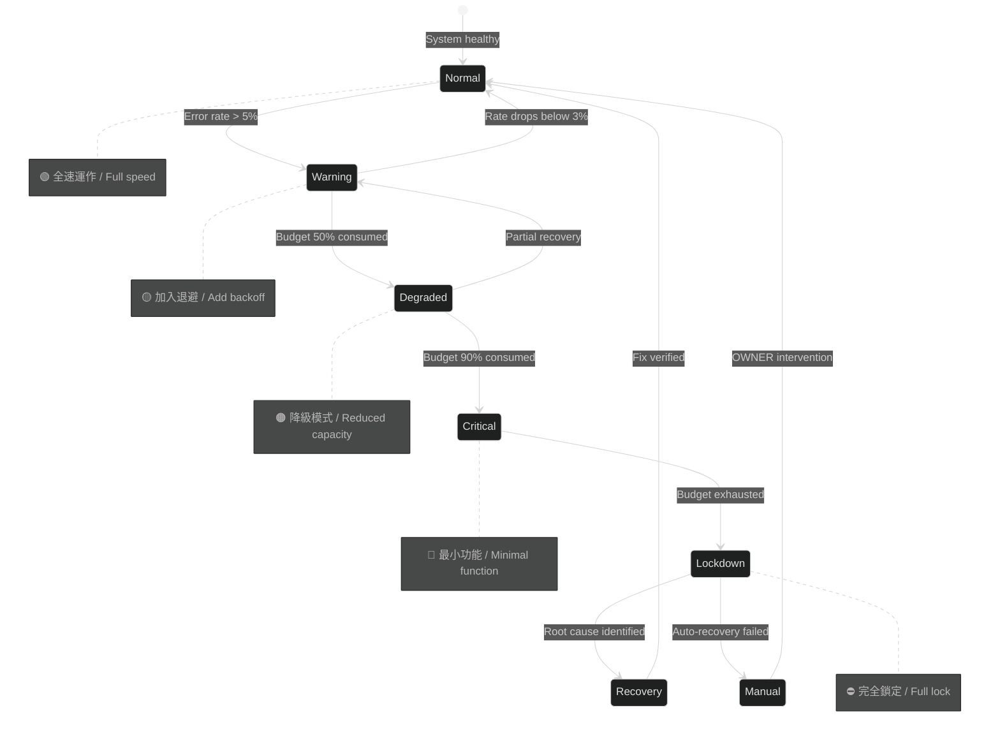
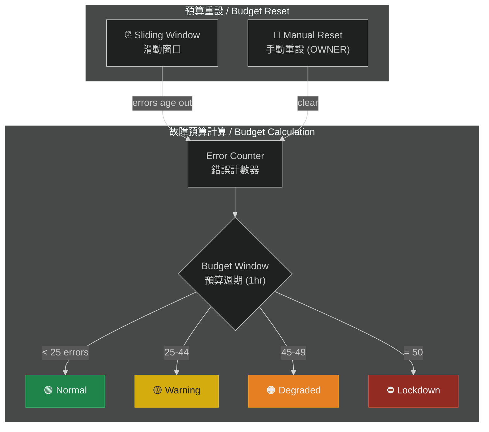
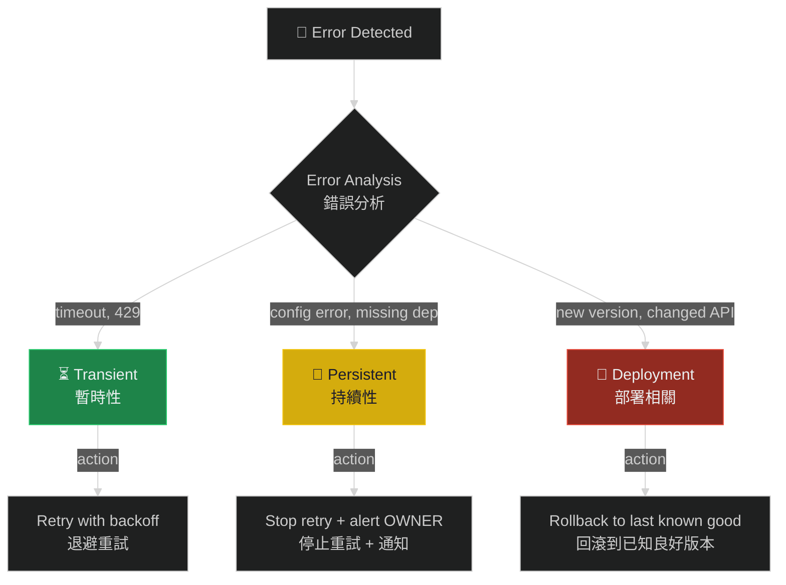

# 失控保護機制

# Failure Budget & Rate Cap

> **Priority / 優先級**: P1
> **Status / 狀態**: Proposed / 提案中
> **Target Version / 目標版本**: v1.5

---

## 問題描述 / Problem Statement

目前 repo 有基本的速率限制（10 req/min/user, injection threshold: 3），但缺乏更深層的失控保護。當系統進入異常狀態時（例如連鎖故障、依賴服務崩潰），目前的機制無法有效阻止系統繼續消耗資源或產生無效重試。

The repo has basic rate limiting (10 req/min/user, injection threshold: 3) but lacks deeper runaway protection. When the system enters an abnormal state (e.g., cascading failures, dependency crashes), current mechanisms cannot effectively prevent resource consumption or futile retries.

### 社群建議 / Community Input

> *"strict caps (max replicas, cooldown, backoff jitter), failure budgets + root-cause isolation, immutable config + audit logs so recovery is observable and rollbackable"*

---

## 系統降級狀態機 / Degradation State Machine



## 核心機制 / Core Mechanisms

### 1. 故障預算 / Failure Budget



### 2. 根因隔離 / Root-Cause Isolation



| 類型 / Type | 特徵 / Characteristics | 回應 / Response |
|------------|----------------------|----------------|
| Transient 暫時性 | 超時、限流 (429)、網路抖動 | 退避重試，限制 3 次 |
| Persistent 持續性 | 配置錯誤、依賴缺失、權限問題 | 停止重試，通知 OWNER |
| Deployment 部署相關 | 新版本 bug、API 變更 | 回滾到已知良好版本 |

### 3. 退避抖動 / Backoff with Jitter

```
delay = min(base_ms * 2^attempt, max_ms) + random(0, jitter_ms)
```

範例 / Example (base=1000, max=60000, jitter=500):

| Attempt | Base Delay | With Jitter |
|---------|-----------|-------------|
| 1 | 2,000ms | 2,000-2,500ms |
| 2 | 4,000ms | 4,000-4,500ms |
| 3 | 8,000ms | 8,000-8,500ms |
| 4 | 16,000ms | 16,000-16,500ms |
| 5 | 32,000ms | 32,000-32,500ms |
| 6+ | 60,000ms | 60,000-60,500ms |

### 4. 不可變配置 / Immutable Config

- 所有配置變更記錄在審計日誌
- 每次修復動作前快照當前配置
- 支援回滾到任意歷史配置
- OWNER 才能修改配置

## 各層級行為 / Behavior by Level

| 層級 / Level | 觸發 / Trigger | 請求處理 / Request Handling | 額外動作 / Extra Actions |
|-------------|---------------|---------------------------|------------------------|
| 🟢 Normal | Error < 5% | 正常處理 | 無 |
| 🟡 Warning | Error 5-15% | 加入退避延遲 | 記錄 warning 日誌 |
| 🟠 Degraded | Budget 50% | 降低吞吐量 50% | 通知 OWNER |
| 🔴 Critical | Budget 90% | 僅處理 OWNER 請求 | 每分鐘告警 |
| ⛔ Lockdown | Budget 100% | 拒絕所有請求 | 持續告警直到介入 |

## 配置 / Configuration

```json
{
  "failure_protection": {
    "enabled": true,
    "budget": {
      "window_seconds": 3600,
      "max_errors": 50,
      "sliding_window": true
    },
    "thresholds": {
      "warning_percent": 5,
      "degraded_percent": 50,
      "critical_percent": 90,
      "lockdown_percent": 100
    },
    "backoff": {
      "base_ms": 1000,
      "max_ms": 60000,
      "jitter_ms": 500,
      "max_retries": 5
    },
    "root_cause": {
      "transient_retry_limit": 3,
      "persistent_alert_after": 5,
      "deployment_rollback_enabled": false
    },
    "lockdown": {
      "allow_owner_requests": true,
      "alert_interval_seconds": 60,
      "auto_recovery_enabled": false
    }
  }
}
```

## 實作步驟 / Implementation Steps

1. 實作錯誤計數器與滑動窗口
2. 實作 5 層降級狀態機
3. 實作退避抖動演算法
4. 實作根因分類器
5. 整合 `security.config.json`
6. 整合審計日誌
7. 更新文件

## 驗收標準 / Acceptance Criteria

- [ ] 滑動窗口故障預算系統
- [ ] 5 層降級狀態（Normal → Lockdown）
- [ ] 根因分類器（Transient / Persistent / Deployment）
- [ ] 指數退避 + 抖動
- [ ] Lockdown 時通知 OWNER
- [ ] 配置變更審計追蹤
- [ ] `security.config.json` 可配置

---

> 📄 Related Issue: `feat: 失控保護機制 (Failure Budget & Rate Cap)`
