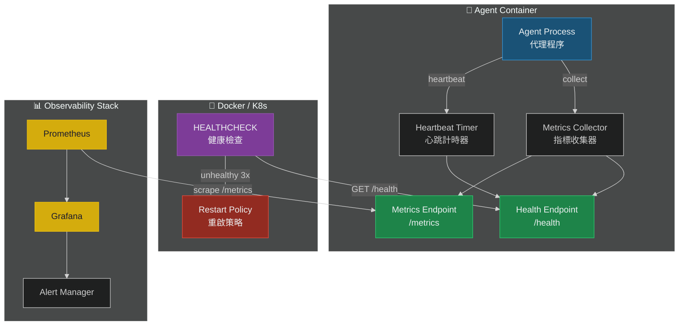

# Health Check / Watchdog 機制

# 健康檢查與看門狗機制

> **Priority / 優先級**: P0
> **Status / 狀態**: Proposed / 提案中
> **Target Version / 目標版本**: v1.5

---

## 問題描述 / Problem Statement

目前 OpenClaw Security Starter 缺乏任何健康監控機制。在生產環境中，代理可能因記憶體洩漏、CPU 過載、或依賴服務故障而靜默停止運作，但 Docker orchestrator 無法偵測到這些狀況並自動重啟容器。

OpenClaw Security Starter currently lacks any health monitoring mechanism. In production, agents may silently stop functioning due to memory leaks, CPU overload, or dependency failures, but Docker orchestrators cannot detect these conditions and auto-restart containers.

### 影響 / Impact

- 代理靜默故障，使用者無法得到回應 / Silent agent failure, users get no response
- 無法主動發現問題，只能被動等待使用者回報 / No proactive detection, only reactive user reports
- Docker/K8s 無法執行自動重啟策略 / Docker/K8s cannot execute auto-restart policies

---

## 提案架構 / Proposed Architecture



## 健康指標 / Health Indicators

| 指標 / Metric | 類型 / Type | 說明 / Description | 閾值 / Threshold |
|--------------|------------|-------------------|-----------------|
| `memory_rss_bytes` | Gauge | RSS 記憶體 / RSS memory | < 512MB |
| `cpu_usage_percent` | Gauge | CPU 使用率 / CPU usage | < 80% |
| `uptime_seconds` | Counter | 運行時間 / Uptime | > 0 |
| `request_rate_per_min` | Gauge | 每分鐘請求數 / Requests/min | configurable |
| `error_rate_percent` | Gauge | 錯誤率 / Error rate | < 5% |
| `last_heartbeat_ms` | Gauge | 上次心跳 / Last heartbeat | < 60000 |
| `security_layers_active` | Gauge | 活躍安全層數 / Active layers | = 4 |

## /health 端點規格 / Endpoint Specification

### Request
```
GET /health HTTP/1.1
Host: localhost:18789
```

### Response (Healthy)
```json
{
  "status": "healthy",
  "timestamp": "2026-03-20T10:30:00Z",
  "uptime_seconds": 3600,
  "version": "1.0.0",
  "checks": {
    "memory": { "status": "pass", "value_mb": 128 },
    "cpu": { "status": "pass", "value_percent": 15 },
    "heartbeat": { "status": "pass", "last_ms": 500 },
    "security_layers": {
      "shield": "active",
      "agent_rules": "active",
      "injection_guard": "active",
      "tool_policy": "active"
    }
  }
}
```

### Response (Unhealthy)
```json
{
  "status": "unhealthy",
  "timestamp": "2026-03-20T10:30:00Z",
  "checks": {
    "memory": { "status": "fail", "value_mb": 490, "threshold_mb": 512 },
    "heartbeat": { "status": "fail", "last_ms": 120000, "threshold_ms": 60000 }
  }
}
```

## Dockerfile HEALTHCHECK

```dockerfile
HEALTHCHECK --interval=30s --timeout=5s --start-period=10s --retries=3 \
  CMD curl -f http://localhost:18789/health || exit 1
```

## 配置 / Configuration

```json
{
  "health_check": {
    "enabled": true,
    "endpoint": "/health",
    "port": 18789,
    "interval_seconds": 30,
    "thresholds": {
      "memory_max_mb": 512,
      "cpu_max_percent": 80,
      "heartbeat_max_ms": 60000,
      "error_rate_max_percent": 5
    },
    "metrics": {
      "enabled": false,
      "endpoint": "/metrics",
      "format": "prometheus"
    }
  }
}
```

## 實作步驟 / Implementation Steps

1. **Dockerfile** — 加入 `HEALTHCHECK` 指令
2. **Health endpoint** — 實作 `/health` HTTP 端點
3. **Metrics collector** — 收集 memory, CPU, uptime 等指標
4. **Heartbeat** — 定時更新心跳時間戳
5. **Metrics endpoint** — （選用）Prometheus 格式 `/metrics`
6. **Config** — 更新 `security.config.json` schema
7. **Docs** — 更新 `architecture.md`

## 驗收標準 / Acceptance Criteria

- [ ] Dockerfile 包含 `HEALTHCHECK` 指令
- [ ] `/health` 回傳結構化 JSON
- [ ] 支援記憶體、CPU、心跳、安全層狀態檢查
- [ ] 不健康狀態回傳 HTTP 503
- [ ] 可在 `security.config.json` 配置閾值
- [ ] 文件更新完成

---

> 📄 Related Issue: `feat: Health Check / Watchdog 機制`
