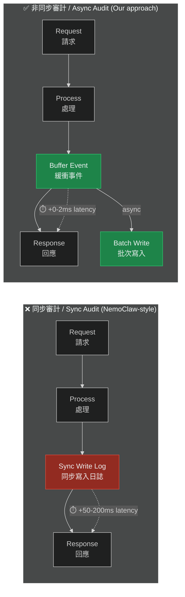
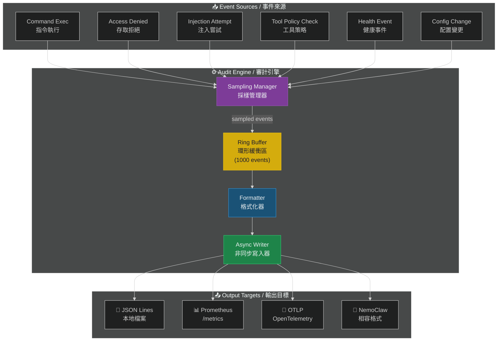

# NemoClaw 相容審計層

# NemoClaw-Compatible Audit Layer

> **Priority / 優先級**: P2
> **Status / 狀態**: Proposed / 提案中
> **Target Version / 目標版本**: v2.0

---

## 問題描述 / Problem Statement

NVIDIA NemoClaw 在 OpenClaw 之上增加了審計功能，但社群反映「效能會變差」。我們的目標是在 OpenClaw Security Starter 中實現同等或更好的審計能力，同時透過非同步設計最小化效能影響。

NVIDIA NemoClaw adds audit capabilities on top of OpenClaw, but the community reports "performance degrades." Our goal is to achieve equivalent or better audit capability in OpenClaw Security Starter while minimizing performance impact through asynchronous design.

### 現狀 / Current State

目前 `security.config.json` 的 audit 區塊提供基本日誌：
- `log_all_commands: true`
- `log_rejections: true`
- `log_injection_attempts: true`
- `include_payload_in_logs: false`

但缺乏結構化格式、指標導出、和與 NemoClaw 的互通性。

---

## 效能對比 / Performance Comparison



## 審計引擎架構 / Audit Engine Architecture



## 日誌格式 / Log Formats

### OpenClaw JSON Lines (主要格式 / Primary)

```json
{"ts":"2026-03-20T10:30:00.000Z","event":"command_exec","actor":"owner:182901234567890123","tool":"web_search","query_hash":"a1b2c3d4","result":"success","latency_ms":42,"shield_level":"T3","injection_scan":"pass","session_id":"sess_abc123"}
{"ts":"2026-03-20T10:30:01.000Z","event":"access_denied","actor":"user:456789012345678901","reason":"untrusted_identity","shield_step":"identity_check","session_id":"sess_def456"}
{"ts":"2026-03-20T10:30:02.000Z","event":"injection_attempt","actor":"user:789012345678901234","pattern":"ignore_previous","severity":"high","action":"blocked","alert_sent":true}
```

### NemoClaw 格式映射 / NemoClaw Format Mapping

| OpenClaw Field | NemoClaw Field | Type | Notes |
|---------------|---------------|------|-------|
| `ts` | `timestamp` | string | ISO 8601 |
| `event` | `event_type` | string | 1:1 mapping |
| `actor` | `principal` | string | Format differs |
| `tool` | `action` | string | Tool name |
| `result` | `outcome` | string | success/failure |
| `latency_ms` | `duration_ms` | number | Same semantics |
| `shield_level` | `auth_level` | string | T0-T4 → NemoClaw levels |
| `injection_scan` | `guardrail_result` | string | pass/fail/skip |

### Prometheus Metrics

```
# HELP openclaw_commands_total Total commands executed
# TYPE openclaw_commands_total counter
openclaw_commands_total{tool="web_search",result="success"} 42

# HELP openclaw_injection_attempts_total Total injection attempts
# TYPE openclaw_injection_attempts_total counter
openclaw_injection_attempts_total{pattern="ignore_previous"} 3

# HELP openclaw_request_latency_ms Request latency histogram
# TYPE openclaw_request_latency_ms histogram
openclaw_request_latency_ms_bucket{le="10"} 5
openclaw_request_latency_ms_bucket{le="50"} 35
openclaw_request_latency_ms_bucket{le="100"} 40
openclaw_request_latency_ms_bucket{le="+Inf"} 42
```

## 效能優化策略 / Performance Optimization

| 策略 / Strategy | 說明 / Description | 效能影響 / Impact |
|----------------|-------------------|-----------------|
| Ring Buffer | 固定大小緩衝區，避免 OOM | O(1) memory |
| Async Write | 非同步批次寫入 | +0-2ms latency |
| Batch Flush | 每 100 筆或 5 秒寫入 | Amortized I/O |
| Sampling | 高流量自動降採樣 | Configurable |
| No Payload | 不記錄完整請求內容 | Privacy + speed |
| Hash Only | 敏感資料只記錄 hash | Security |

## 配置 / Configuration

```json
{
  "audit": {
    "log_all_commands": true,
    "log_rejections": true,
    "log_injection_attempts": true,
    "include_payload_in_logs": false,
    "format": "jsonl",
    "output": {
      "file": {
        "enabled": true,
        "path": "/var/log/openclaw/audit.jsonl",
        "max_size_mb": 100,
        "rotation": "daily",
        "retention_days": 30
      },
      "prometheus": {
        "enabled": false,
        "endpoint": "/metrics"
      },
      "otlp": {
        "enabled": false,
        "endpoint": "http://localhost:4318",
        "protocol": "http/protobuf"
      },
      "nemoclaw_compat": {
        "enabled": false,
        "format_version": "1.0"
      }
    },
    "performance": {
      "async_buffer": true,
      "buffer_size": 1000,
      "flush_interval_ms": 5000,
      "flush_batch_size": 100,
      "sampling_rate": 1.0,
      "sampling_auto_adjust": true
    }
  }
}
```

## 實作步驟 / Implementation Steps

1. 定義結構化日誌 schema（JSON Lines）
2. 實作 Ring Buffer + Async Writer
3. 實作 Prometheus metrics 端點
4. 實作 NemoClaw 格式轉換器
5. （選用）實作 OTLP exporter
6. 效能基準測試
7. 更新 `security.config.json`
8. 更新文件

## 驗收標準 / Acceptance Criteria

- [ ] JSON Lines 結構化日誌
- [ ] 非同步寫入，延遲增加 < 5ms
- [ ] Ring buffer 防止 OOM
- [ ] Prometheus /metrics 端點
- [ ] NemoClaw 格式映射文件
- [ ] 日誌輪替 + 保留策略
- [ ] 效能基準：審計開啟 vs 關閉延遲對比

---

> 📄 Related Issue: `feat: NemoClaw 相容審計層`
