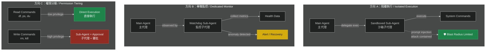
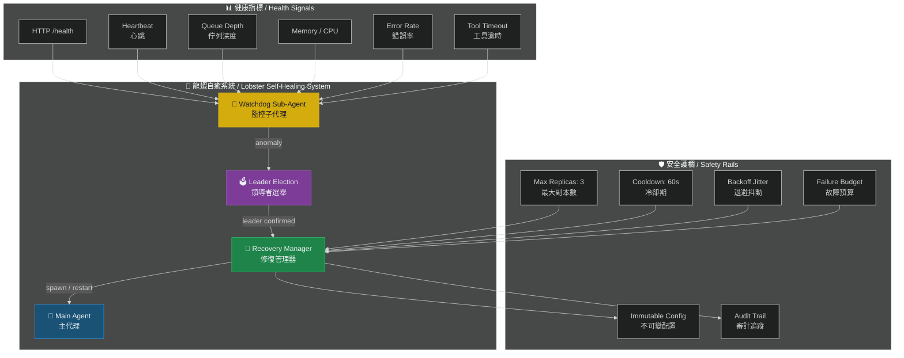
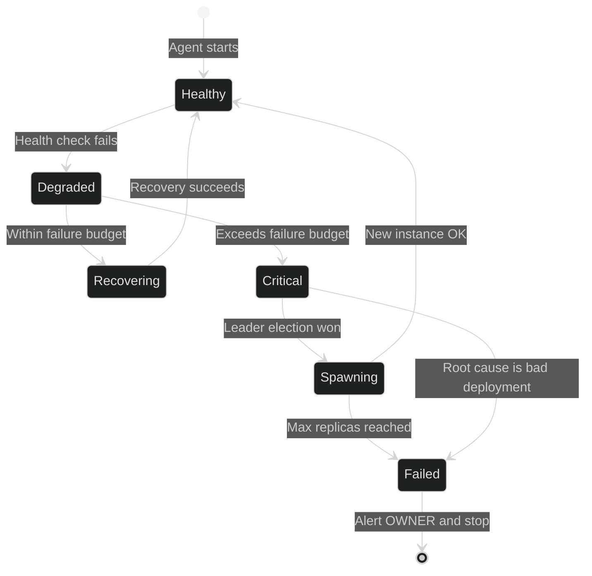

# Sub-Agent 監控架構 — 龍蝦自癒模式

# Sub-Agent Monitoring — Lobster Self-Healing Architecture 🦞

> **Priority / 優先級**: P2
> **Status / 狀態**: Proposed / 提案中
> **Target Version / 目標版本**: v2.0

---

## 問題描述 / Problem Statement

在傳統的 agent 部署中，主代理的故障通常需要外部介入才能修復。受到龍蝦斷肢再生能力的啟發 🦞，我們提出使用 sub-agent 來實現自動監控與自癒的架構。

In traditional agent deployments, main agent failures typically require external intervention to resolve. Inspired by the lobster's limb regeneration ability 🦞, we propose using sub-agents for automated monitoring and self-healing.

### 社群背景 / Community Context

此概念源自社群討論：
- 舊金山後端工程師建議參考 K8s self-healing pod 模式
- 提出外部看門狗、嚴格上限、quorum 檢查、故障預算等機制
- 使用 sub-agent 做監控是一個在安全與自主性之間取得平衡的方向

---

## 三種可行架構 / Three Architecture Options



## 推薦架構：混合模式 / Recommended: Hybrid Approach

結合三種方向的優點：



## 自癒狀態機 / Self-Healing State Machine



## 防止無限增生 / Preventing Runaway Spawning

這是此架構最關鍵的安全考量：

| 機制 / Mechanism | 說明 / Description | 設定 / Setting |
|-----------------|-------------------|---------------|
| Max Replicas | 最大副本數上限 | 3 |
| Cooldown | 兩次 spawn 之間的最短間隔 | 60 seconds |
| Backoff Jitter | 避免驚群效應的隨機延遲 | 0-500ms |
| Failure Budget | 累計錯誤預算 | 50 errors/hour |
| Quorum Check | 只有 leader 能觸發 spawn | Lease-based |
| Root-Cause Gate | 壞部署時禁止 spawn | Auto-detect |

## 配置 / Configuration

```json
{
  "self_healing": {
    "enabled": false,
    "watchdog": {
      "check_interval_seconds": 30,
      "health_signals": ["http_health", "heartbeat", "error_rate", "memory"],
      "anomaly_threshold": 3
    },
    "recovery": {
      "max_replicas": 3,
      "cooldown_seconds": 60,
      "backoff_base_ms": 1000,
      "backoff_max_ms": 30000,
      "jitter_ms": 500
    },
    "leader_election": {
      "lease_duration_seconds": 300,
      "renew_interval_seconds": 60
    },
    "safety": {
      "failure_budget_per_hour": 50,
      "block_on_bad_deployment": true,
      "audit_all_recovery_actions": true
    }
  }
}
```

## 實作步驟 / Implementation Steps

1. **Phase 1** — Watchdog sub-agent 基礎架構
2. **Phase 2** — 健康指標收集（依賴 Health Check 提案）
3. **Phase 3** — Leader election 機制
4. **Phase 4** — Recovery manager + spawn 邏輯
5. **Phase 5** — 安全護欄（max replicas, cooldown, budget）
6. **Phase 6** — 審計日誌整合（依賴 Audit Layer 提案）

## 前置依賴 / Prerequisites

- Health Check / Watchdog 機制 (P0) — 提供健康指標
- 失控保護機制 (P1) — 提供 failure budget 基礎
- NemoClaw 相容審計層 (P2) — 提供審計日誌

## 驗收標準 / Acceptance Criteria

- [ ] Watchdog sub-agent 可獨立運作
- [ ] 支援 6 種以上健康指標
- [ ] Leader election 避免多個 leader 同時操作
- [ ] Max replica + cooldown 防護就位
- [ ] 壞部署時自動停止 spawn
- [ ] 所有自癒動作記錄在審計日誌
- [ ] 完整的架構決策文件

---

> 🦞 *「龍蝦會斷肢再生，系統也能自我修復」— 社群討論靈感*
> 📄 Related Issue: `feat: Sub-Agent 監控架構 — 龍蝦自癒模式`
