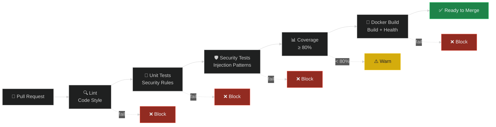
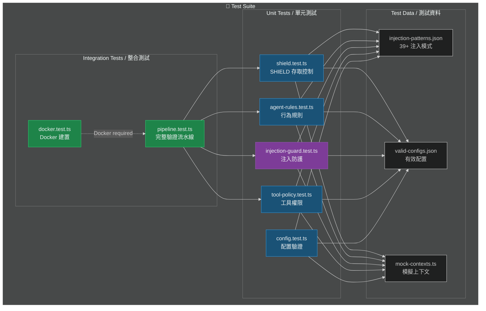
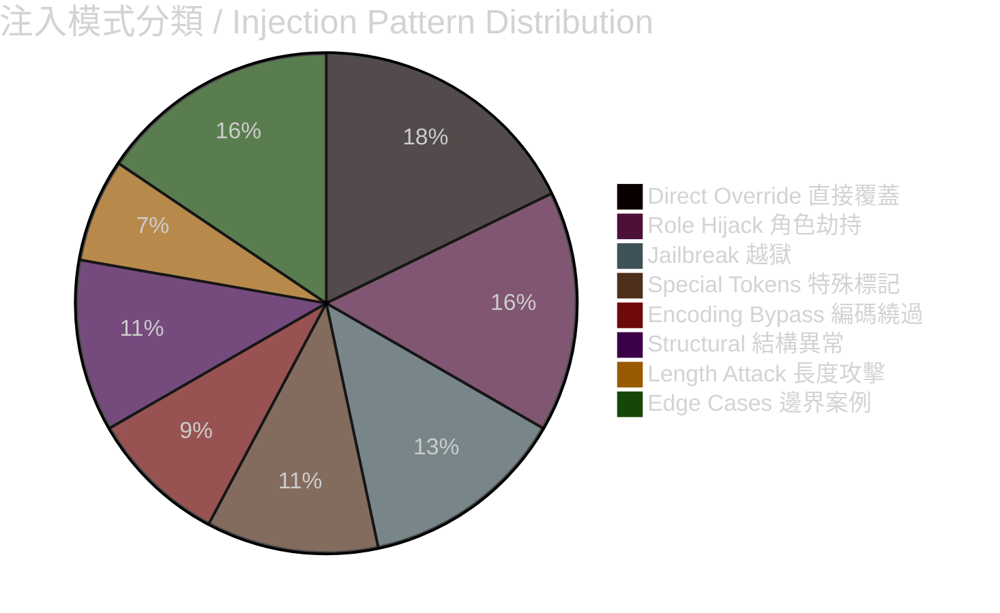

# 測試套件與 CI/CD

# Test Suite & CI/CD Pipeline

> **Priority / 優先級**: P0
> **Status / 狀態**: Proposed / 提案中
> **Target Version / 目標版本**: v1.5

---

## 問題描述 / Problem Statement

目前 OpenClaw Security Starter **完全沒有測試和 CI/CD**。這意味著：
- 任何修改都可能意外破壞現有安全防線
- 無法驗證注入防護模式是否有效
- Pull Request 缺乏自動化品質門檻
- Docker 建置未被驗證

Currently OpenClaw Security Starter has **zero tests and zero CI/CD**. This means any modification could accidentally break existing security defenses, injection guard patterns can't be verified, PRs lack automated quality gates, and Docker builds go unverified.

---

## CI/CD 流水線 / Pipeline Architecture



## 測試架構 / Test Architecture



## 測試計畫 / Test Plan

### 1. SHIELD 存取控制（~15 test cases）

| # | 測試案例 / Test Case | 預期 / Expected |
|---|---------------------|----------------|
| 1 | DM 訊息自動通過 | PASS |
| 2 | 頻道 + 正確 @mention | PASS |
| 3 | 頻道無 mention | REJECT |
| 4 | Discord `<@BOT_ID>` 格式 | PASS |
| 5 | LINE `@DisplayName` 格式 | PASS |
| 6 | Telegram `/command` 格式 | PASS |
| 7 | OWNER ID → bypass | BYPASS |
| 8 | DELEGATE ID → limited | LIMITED |
| 9 | UNTRUSTED ID → restricted | RESTRICTED |
| 10 | BLOCKED ID → reject | BLOCK |
| 11 | OWNER guild bypass | BYPASS |
| 12 | 無效 mention 格式 | REJECT |
| 13 | 空 message | REJECT |
| 14 | Rate limit exceeded | THROTTLE |
| 15 | Multiple mentions | PASS (first match) |

### 2. 注入防護（~45 test cases）

測試所有 39+ 個注入模式 + edge cases：



### 3. TOOL_POLICY（~20 test cases）

- T0 BLOCKED: `delete_file`, `run_query` → 確認被禁止
- T1 OWNER_ONLY: `reload_config`, `run_command` → 僅 OWNER 可用
- T2 DELEGATE: `read_file`, `http_request` → OWNER + DELEGATE
- T3 AUTHENTICATED: `web_search` → 已認證使用者
- T4 PUBLIC: 公開工具
- 未註冊工具 → 預設拒絕

### 4. Config 驗證（~10 test cases）

- 有效配置 → 通過
- 缺少必要欄位 → 錯誤
- 無效值（負數、超範圍） → 錯誤
- 預設值回退 → 正確

## 目錄結構 / Directory Structure

```
tests/
├── unit/
│   ├── shield.test.ts
│   ├── agent-rules.test.ts
│   ├── injection-guard.test.ts
│   ├── tool-policy.test.ts
│   └── config.test.ts
├── integration/
│   ├── pipeline.test.ts
│   └── docker.test.ts
├── fixtures/
│   ├── injection-patterns.json
│   ├── valid-configs.json
│   └── invalid-configs.json
└── helpers/
    ├── mock-context.ts
    └── test-utils.ts
```

## GitHub Actions Workflow

### `.github/workflows/ci.yml`

```yaml
name: CI

on:
  push:
    branches: [main]
  pull_request:
    branches: [main]

jobs:
  lint:
    runs-on: ubuntu-latest
    steps:
      - uses: actions/checkout@v4
      - uses: actions/setup-node@v4
        with:
          node-version: '20'
      - run: npm ci
      - run: npm run lint

  test:
    runs-on: ubuntu-latest
    needs: lint
    steps:
      - uses: actions/checkout@v4
      - uses: actions/setup-node@v4
        with:
          node-version: '20'
      - run: npm ci
      - run: npm test -- --coverage
      - uses: actions/upload-artifact@v4
        with:
          name: coverage
          path: coverage/

  security-test:
    runs-on: ubuntu-latest
    needs: lint
    steps:
      - uses: actions/checkout@v4
      - uses: actions/setup-node@v4
        with:
          node-version: '20'
      - run: npm ci
      - run: npm run test:security

  docker-build:
    runs-on: ubuntu-latest
    needs: [test, security-test]
    steps:
      - uses: actions/checkout@v4
      - name: Build Docker image
        run: docker build -t openclaw-security-test .
      - name: Verify container starts
        run: |
          docker run -d --name test-container openclaw-security-test
          sleep 5
          docker inspect --format='{{.State.Health.Status}}' test-container || true
          docker stop test-container
          docker rm test-container
```

## 配置檔案 / Config Files

### `package.json` (新增 scripts)

```json
{
  "scripts": {
    "test": "vitest run",
    "test:watch": "vitest",
    "test:coverage": "vitest run --coverage",
    "test:security": "vitest run tests/unit/injection-guard.test.ts",
    "lint": "eslint . --ext .ts,.js",
    "lint:fix": "eslint . --ext .ts,.js --fix"
  }
}
```

## 實作步驟 / Implementation Steps

1. 初始化測試框架（Vitest）
2. 建立測試目錄結構
3. 撰寫 SHIELD 測試
4. 撰寫注入防護測試（39+ patterns）
5. 撰寫 TOOL_POLICY 測試
6. 撰寫配置驗證測試
7. 建立 GitHub Actions workflow
8. 加入 Docker build 驗證
9. 設定覆蓋率門檻

## 驗收標準 / Acceptance Criteria

- [ ] Vitest 測試框架配置完成
- [ ] SHIELD 測試 ≥ 15 cases
- [ ] 注入防護測試覆蓋 39+ patterns
- [ ] TOOL_POLICY 測試覆蓋 5 tiers
- [ ] Config 驗證測試 ≥ 10 cases
- [ ] GitHub Actions CI 正常運作
- [ ] Docker build 驗證通過
- [ ] 總覆蓋率 ≥ 80%

---

> 📄 Related Issue: `chore: 加入測試套件與 CI/CD`
